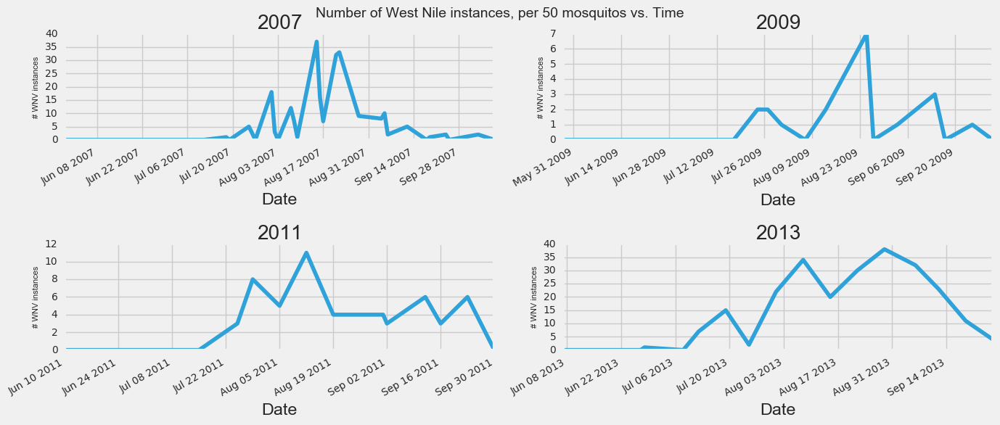

# Data Science Training

A data science tutorial using SQL, Python, and Jupyter Notebook.

The tutorial is centered around the Kaggle competition: [West Nile Virus Prediction](https://www.kaggle.com/c/predict-west-nile-virus).

## Problem Statement
`Given weather, location, testing, and spraying data, this competition asks you to predict when and where different species of mosquitos will test positive for West Nile virus`

## Results

